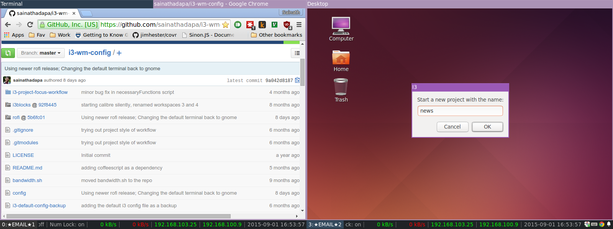
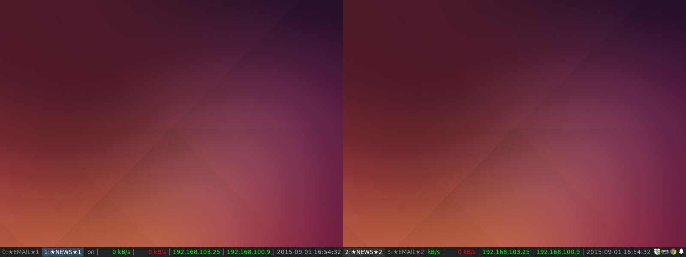
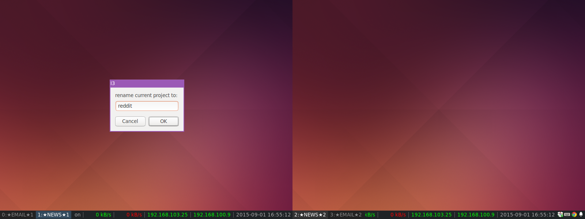
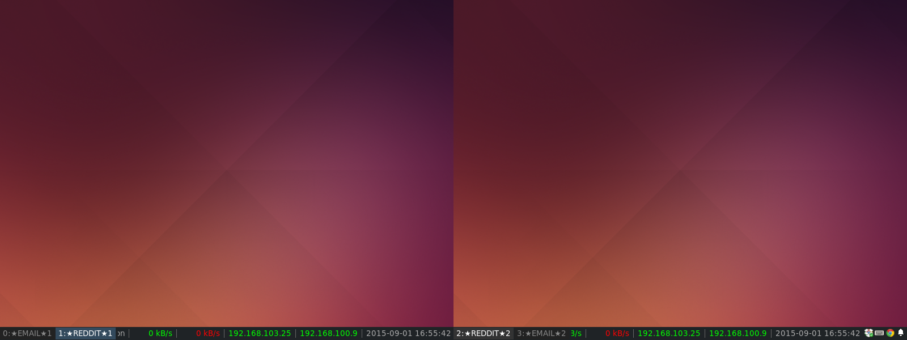
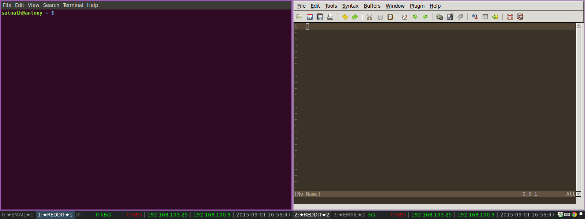
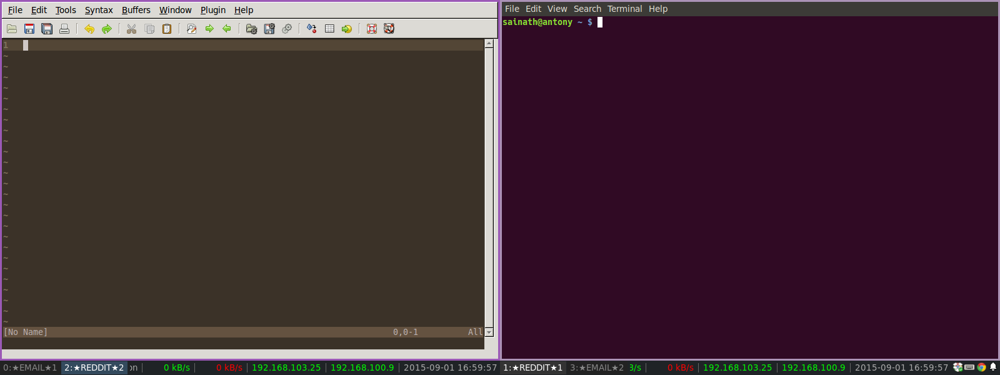
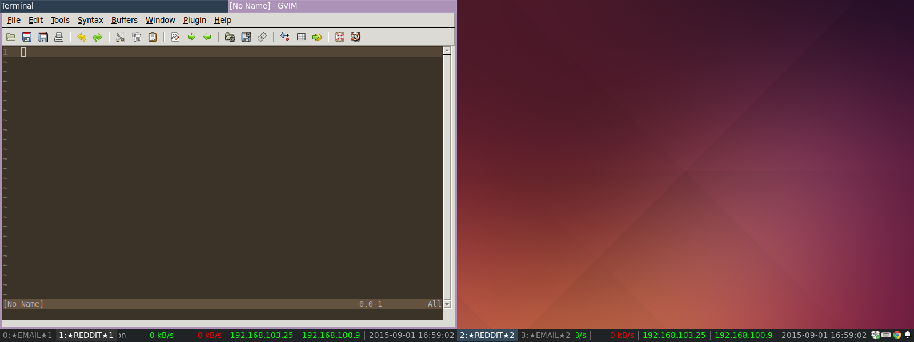

# Install
- Install NodeJS, NPM and Coffeescript (apt-get install nodejs npm coffeescript)
- cd .i3/i3-project-focus-workflow/; npm install
- Bind the scripts to shortcut keys in the I3 config file

# Usage
- A project is defined as a set of workspaces, one workspace for each display/monitor available.
- To create a new project, run newProjectWorkspaces.coffee script. This will display a dialog box asking for the project name. Names of the workspaces will contain the project name.

Dialog box:

After:

- To rename a project, run renameProject.coffee. This will display a dialog box asking for the new project name.

Dialog box:

After:

- To switch to the next project, run switchNextProject.coffee
- To cycle the focus between the workspaces in a project, run cycleProjectWorkspacesFocus.coffee
- To shift all the workspaces in a project to each one's respective next display, run cycleProjectWorkspacesOutput.coffee. For example, if the initial state of the workspaces is {Wksp 1 - Disp 1}, {Wksp 2 - Disp 2}, {Wksp 3 - Disp 3}, after running the script, the final state will be {Wksp 1 - Disp 2}, {Wksp 2 - Disp 3}, {Wksp 3 - Disp 1}.

Initial state:

After running the script:

- To switch the focused container to the next workspace in the project, run cycleContainerProjectWorkspaces.coffee.

Initial state:

After running the script:

